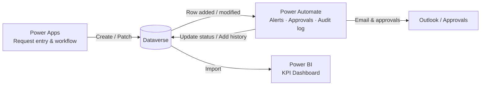
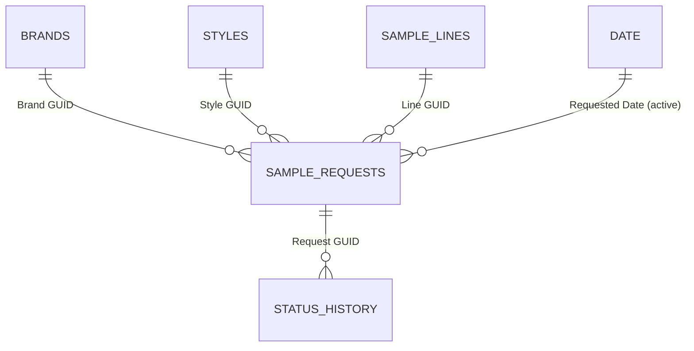
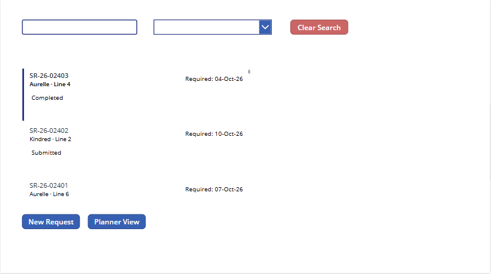
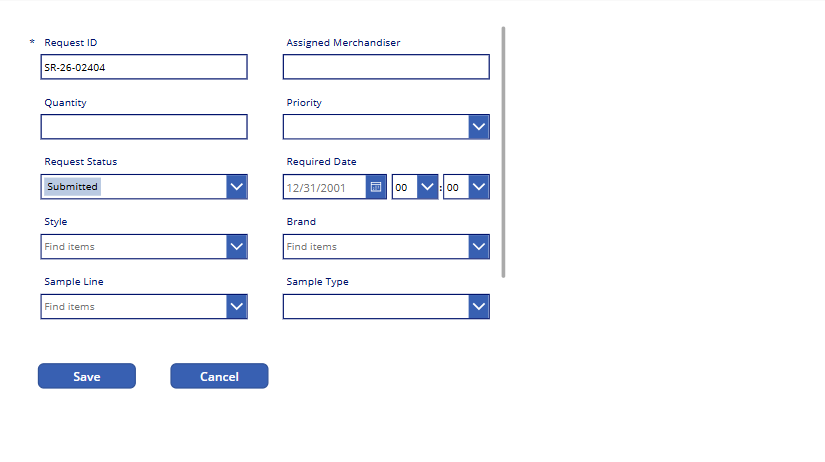
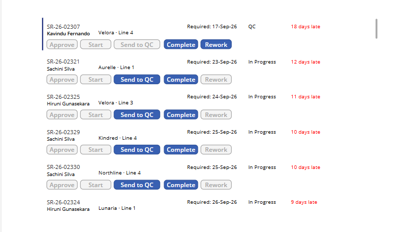
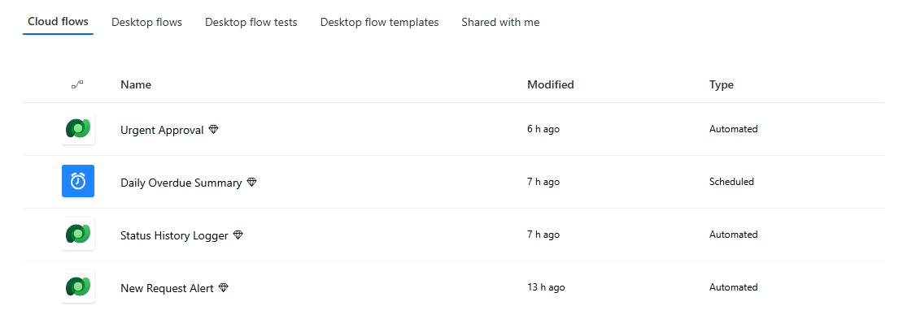
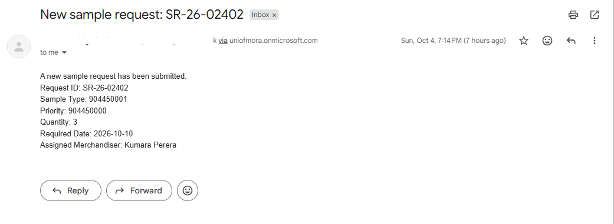
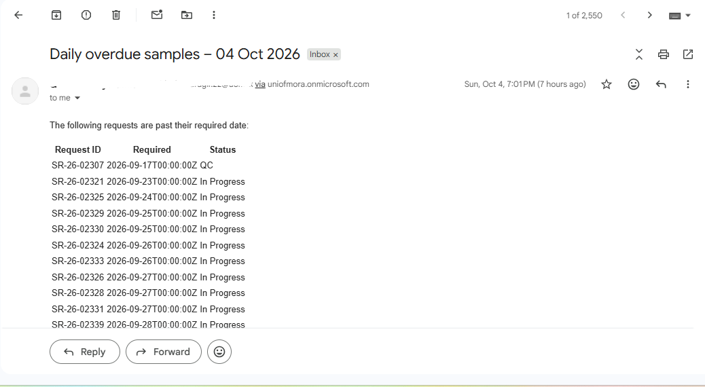

# Sample Request Tracker – Power Platform End-to-End Solution

An end-to-end system for tracking garment **sample requests** — from the moment a merchandiser raises a request to sample completion — built with **Power Apps, Dataverse, Power Automate and Power BI**.

🔗 **Live dashboard:** [View the Power BI report]((https://app.powerbi.com/view?r=eyJrIjoiYTAzNzNhNzgtZTgxOS00MDU2LTllZjYtYTc2ZDZlMzU3M2MwIiwidCI6ImFhYzBjNTY0LTZjNWUtNGIwNS04ZGMzLTQwODA4N2Y3N2Y3NiIsImMiOjEwfQ%3D%3D))

🔗 **View PowerApp:** [View the PowerApp created] (https://apps.powerapps.com/play/e/1cbe9ceb-8ab7-e05f-ae12-e060353a589d/a/013ba833-20b5-455d-99ad-5203ddff1355?tenantId=aac0c564-6c5e-4b05-8dc3-408087f77f76&hint=b6155a0d-eed6-4b60-a056-b4c171a7845f&source=sharebutton&sourcetime=1791149091777#)

> ⚠️ All data in this project is **synthetic** and was generated for demonstration purposes. Brand names, styles and people are fictional.

---

## 📌 Business Problem

In apparel manufacturing, sample rooms handle hundreds of sample requests (proto, fit, size set, salesman samples, pre-production) every month. When these are tracked through emails and spreadsheets:

- There is **no single view** of where each sample is in the process
- **Delays are noticed too late**, after the required date has passed
- Urgent requests depend on manual follow-ups for approval
- There is **no audit trail** of who changed what and when
- Management lacks reliable KPIs such as **on-time delivery %, lead time and rework rate**

## 💡 Solution Overview

| Component | Role |
|---|---|
| **Dataverse** | Central relational database for requests, styles, brands, sample lines and status history |
| **Power Apps (Canvas)** | Data entry and workflow app for merchandisers and planners |
| **Power Automate** | Automated alerts, approvals, audit logging and daily overdue reporting |
| **Power BI** | KPI dashboard for operational and management reporting |

## 🏗️ Architecture



---

## ✨ Features

### 1. Power Apps – Sample Request Tracker

| Screen | Users | What it does |
|---|---|---|
| **Requests List** | Everyone | Lists all requests (newest first) with search by Request ID, status filter, a *Clear Search* button and pink highlighting for overdue open requests |
| **Request Form** | Merchandisers | Create or edit a request. **Request ID is auto-generated** in sequence (`SR-26-02404`), status defaults to *Submitted*, and **Brand auto-fills from the selected Style** |
| **Planner View** | Planners / line supervisors | Shows only open requests sorted by required date, with **days-late indicators** and workflow buttons |

**Workflow (Planner buttons)** — each button is only enabled at the correct stage, so steps cannot be skipped:

```
Submitted → Approve → Approved → Start → In Progress → Send to QC → QC → Complete → Completed
                                                                        ↓
                                                                     Rework → Send to QC
```

Key Power Fx techniques: `Patch()`, `Filter()` / `StartsWith()` / `Sort()` (delegable to Dataverse), `LookUp()`, `With()`, conditional `DisplayMode`, form modes (`NewForm` / `EditForm` / `SubmitForm`).

### 2. Power Automate – 4 Cloud Flows

| Flow | Trigger | What it does |
|---|---|---|
| **New Request Alert** | Dataverse – row added | Emails the planner with the new request's details |
| **Urgent Approval** | Dataverse – row added, filtered to `Priority = Urgent` | Sends an approval; on approval, **automatically updates the request status** to *Approved* |
| **Status History Logger** | Dataverse – row modified (`Request Status` column only) | Writes an **audit record** (old status → new status, changed by, changed on) to the Status History table |
| **Daily Overdue Summary** | Scheduled – daily 8:00 AM (UTC+5:30) | Emails an HTML table of all open requests past their required date |

### 3. Power BI – KPI Dashboard

| Page | Contents |
|---|---|
| **Overview** | KPI cards (Total Requests, On-Time %, Avg Lead Time, Overdue Open, Rework Rate), monthly request volume, on-time % trend vs 90% target, requests by brand |
| **Teams & Capacity** | On-time % by sample line (conditional colouring vs target), avg lead time by sample type, weekly capacity-utilisation heatmap, line summary table |
| **Request Detail** | Drill-through page showing open requests for a selected line/brand, with status icons and overdue highlighting |
| **Tooltip page** | Hover tooltip with On-Time %, Avg Lead Time and Rework Rate for the hovered bar |

Interactivity: synced slicers (date, brand, line, sample type), page navigation buttons, drill-through and report-page tooltips.

---

## 🗄️ Data Model

### Dataverse tables

| Table | Type | Key columns |
|---|---|---|
| **Sample Request** | Fact | Request ID, Style, Brand, Sample Line (lookups), Sample Type, Priority, Request Status (choices), Quantity, Requested / Required / Completed Date, Rework, Assigned Merchandiser |
| **Status History** | Fact (audit log) | History ID, Request (lookup), Old Status, New Status, Changed On, Changed By |
| **Style** | Dimension | Style No, Brand (lookup), Category, Season |
| **Brand** | Dimension | Brand Name, Region, Brand Tier |
| **Sample Line** | Dimension | Line Name, Supervisor, Weekly Capacity |

### Power BI star schema



- **Date** table has one active relationship (Requested Date) and two **inactive** relationships (Required Date, Completed Date), used via `USERELATIONSHIP()`.
- Style → Brand is intentionally **not** related in the model to avoid ambiguous filter paths.

### Power Query transformations
- Selected and renamed relevant columns from Dataverse system tables
- Mapped choice values to labels where the connector returned nulls
- **Corrected a UTC date shift** (Dataverse stores dates in UTC; dates were adjusted by +5:30 before converting to `Date`)
- Added calculated columns: `Lead Time Days`, `Is On Time`, `Days Late`, `Is Open`

---

## 📐 Key DAX Measures

```DAX
On-Time % =
DIVIDE(
    CALCULATE(COUNTROWS('Sample Requests'), 'Sample Requests'[Is On Time] = TRUE()),
    CALCULATE(COUNTROWS('Sample Requests'), 'Sample Requests'[Request Status] = "Completed")
)
```

```DAX
Overdue Open =
CALCULATE(
    [Total Requests],
    'Sample Requests'[Is Open] = TRUE(),
    'Sample Requests'[Required Date] < TODAY(),
    REMOVEFILTERS('Date')          -- live status, unaffected by the date slicer
)
```

```DAX
Requests Due =
CALCULATE(
    [Total Requests],
    USERELATIONSHIP('Sample Requests'[Required Date], 'Date'[Date])   -- uses inactive relationship
)
```

```DAX
Requests YoY % =
VAR LY = CALCULATE([Total Requests], SAMEPERIODLASTYEAR('Date'[Date]))
RETURN DIVIDE([Total Requests] - LY, LY)
```

```DAX
Capacity Util % =
DIVIDE(
    SUM('Sample Requests'[Quantity]),
    SUM('Sample Lines'[Weekly Capacity]) * DISTINCTCOUNT('Date'[Year Week])
)
```

Full list of measures: [`docs/dax-measures.md`](docs/dax-measures.md)

---

## 📸 Screenshots

### Requests List


### Request Form (auto-generated ID, default status)


### Planner View (stage-based buttons and days-late indicators)


### Power Automate Flows


### Automated Email – New Request Alert


### Automated Email – Daily Overdue Summary



---

## 🚀 How to Deploy

**Prerequisites:** a Power Platform environment with Dataverse (e.g. the free [Power Apps Developer Plan](https://www.microsoft.com/power-platform/products/power-apps/free)), Power BI Desktop.

1. **Import the solution**
   make.powerapps.com → **Solutions → Import solution** → upload `solution/SampleRequestTracker_1_0_0_0.zip` → create/select connections for Dataverse, Office 365 Outlook and Approvals.
2. **Load the sample data** (in this order, so lookups resolve)
   Settings → Advanced settings → Data management → **Imports → Import data**, then upload `1_Brands` → `2_SampleLines` → `3_Styles` → `4_SampleRequests` → `5_StatusHistory`. Map lookups to the related table's primary column (e.g. Brand → *Brand Name*).
3. **Configure the flows**
   - In **Urgent Approval**, set *Assigned to* to a user in your organisation.
   - Update email recipients in **New Request Alert** and **Daily Overdue Summary**.
   - Check the choice values used in trigger filters match your environment, then turn all flows **On**.
4. **Open the app**
   Play **Sample Request Tracker** from the Apps list.
5. **Connect Power BI**
   Open `powerbi/Sample_Request_KPI_Dashboard.pbix` → **Transform data → Data source settings** → change the Dataverse environment URL to your own → **Refresh**.

---

## 🛠️ Tools & Skills Demonstrated

| Area | Details |
|---|---|
| **Power Apps** | Canvas app design, Power Fx, delegation-aware queries, forms, galleries, conditional formatting |
| **Dataverse** | Relational table design, lookups, choice columns, data import |
| **Power Automate** | Dataverse triggers with filters and column selection, approvals, conditions, OData queries, expressions, scheduled flows, HTML tables |
| **Power BI** | Power Query (M), star-schema modelling, active/inactive relationships, DAX (time intelligence, `CALCULATE`, `USERELATIONSHIP`, `REMOVEFILTERS`), drill-through, tooltips, conditional formatting |
| **Business analysis** | Process mapping of the sample workflow, KPI definition (on-time %, lead time, rework rate, capacity utilisation) |


